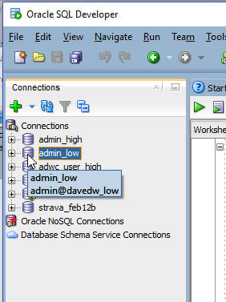
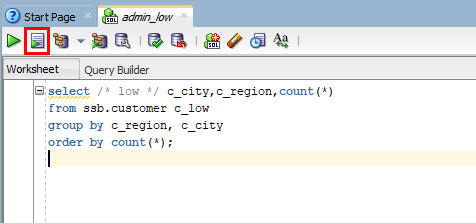
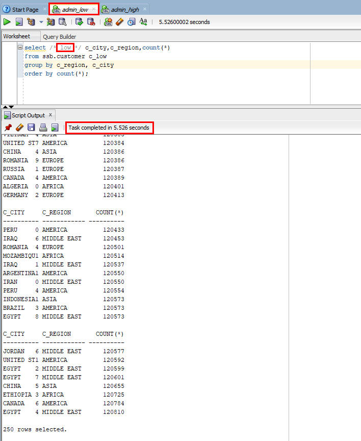
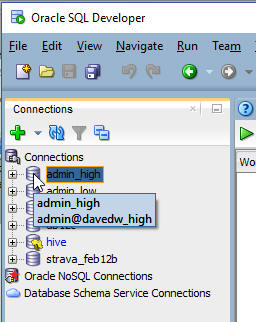
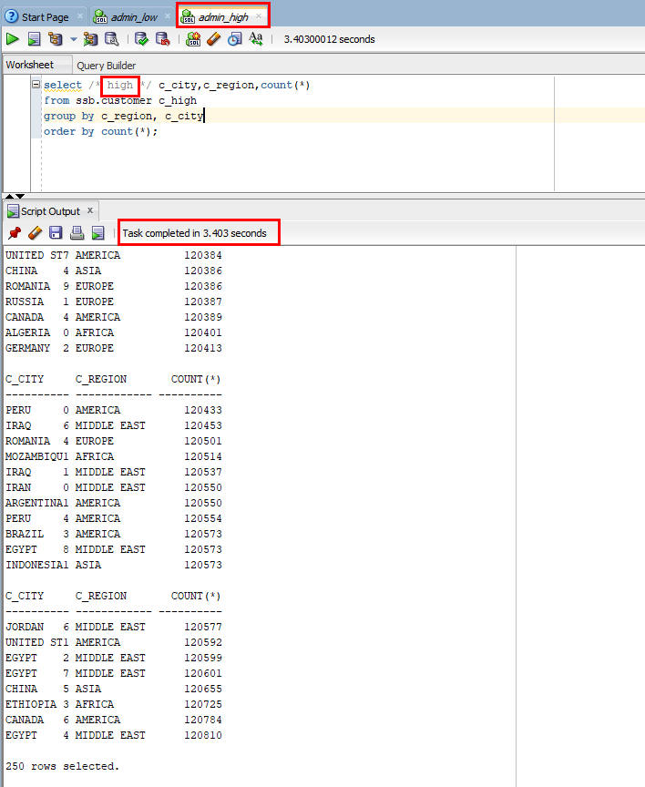
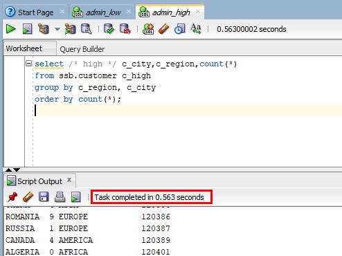

# ADWC Lab 200: Working with Database Services and Sample Data Sets

## Introduction

In this lab you will explore the provided sample data sets and experiment with the choices of database services that come with your ADWC instance.

Autonomous Data Warehouse Cloud provides three database services that you can choose when connecting to your database. These are named as HIGH, MEDIUM, and LOW services and provide different levels of performance and concurrency. 

The HIGH database service provides the maximum amount of resources for a query, this also means the number of concurrent queries you can run in this service will not be as much as the other services. 

The MEDIUM database service provides multiple compute and IO resources for a query. This service also provides more concurrency compared to the HIGH database service. 

The LOW database service provides the least amount of resources for a query, this also means the number of concurrent queries you can run in this service will  be higher than the other services. 

As a user you need to pick the database service based on your performance and concurrency requirements.

The lab will use the LOW and HIGH database services to understand the performance differences between them. The demo will run queries on sample data sets provided out of the box with ADWC. ADWC provides the Oracle Sales History sample schema and the Star Schema Benchmark (SSB) data set, these data sets are in the SH and SSB schemas respectively. 

You will run queries on the SSB data set which is a 1TB data set with one fact table with around 6 billion rows, and several dimension tables.

To **log issues**, click [here](https://github.com/millerhoo/journey4-adwc/issues/new) to go to the github oracle repository issue submission form.

## Objectives

-   Learn about the different levels of ADWC database service (HIGH, MEDIUM, LOW)
- Learn about the Star Schema Benchmark (SSB) and Sales History (SH) sample data sets
- See how the different levels of database service affect performance and concurrency

## Required Artifacts

-   The following lab requires an Oracle Public Cloud account. You may your own cloud account, a cloud account that you obtained through a trial, or a training account whose details were given to you by an Oracle instructor.

-   Oracle SQL Developer (see Lab100 for more specifics on the version of SQL Developer and how to install and configure it).

# Connect and Query with the LOW database service

 Note: For this demonstration to work, your ADWC instance should be configured with at least 2 OCPUs.  With 1 OCPU, you will not see much difference in performance.

## Steps

### STEP 1: Open up SQL Developer and connect to the admin_low database connection you previously created

-   You can do this via expanding the list of connections and double-clicking on the admin_low connection.

    

-   Copy and paste <a href="./scripts/200/low_ssb_query.txt" target="_blank">this code snippet</a> to SQL Developer worksheet. Take a moment to examine the script. Then click the **Run Script** button to run it. Make sure you click the Run Script button in SQL Developer so that all the rows are displayed on the screen.

    

-   Make a note of the response time.

    

# Connect and Query with the HIGH database service

## Steps

### STEP 2: Open up SQL Developer and connect to the admin_high database connection you previously created

-   You can do this via expanding the list of connections and double-clicking on the admin_high connection.

    

-   Copy and paste <a href="./scripts/200/high_ssb_query.txt" target="_blank">this code snippet</a> to SQL Developer worksheet. This query is basically the same as the previous one except the comment after the select keyword and the table alias.

-   Then click the **Run Script** button to run it. Make sure you click the Run Script button in SQL Developer so that all the rows are displayed on the screen.

    

-   Make a note of the response time.  In this example, the query with the LOW database service finished in 5.5 seconds compared to 3.4 seconds for the HIGH database service.

    

-   A query running in the HIGH database service can use more resources and run faster compared to a query running in the LOW database service. As you scale up the compute capacity of your ADWC service you will realize that the queries will get faster in the HIGH database service.

# Explore the query results caching
ADWC also caches the results of a query for you. If you run the same queries again you will see that they will run much faster. 

## Steps

### STEP 3: Run the previous query you just ran

-   Click the **Run Script** button to run it. Make sure you click the Run Script button in SQL Developer so that all the rows are displayed on the screen.

    

-   Make a note of the response time.  

    

-   This time you will see that the query finishes in less than a second.

# Explore additional queries with the Sample Schemas 

## Steps

### STEP 4: Experiment with running other sample queries

-   You can find more sample queries to run in the ADWC documentation.  Try some of the queries from <a href="https://docs.oracle.com/en/cloud/paas/autonomous-data-warehouse-cloud/user/sample-queries.html">here</a>.