# ADWC Lab DIPC: Using Oracle Data Integration Platform Cloud (DIPC) with ADWC

## Introduction

In this lab, you will configure and use Oracle Data Integration Platform Cloud (DIPC) with ADWCS.  The labs follow a typical enterprise data warehouse reference implementation with ETL/ELT batch processing, real time data replication, and data quality review.  You will load data from a flat file and a database table using Oracle Data Integrator (ODI) to your ADWC database.  You will replicate data from a database table to ADWCS using Oracle Golden Gate (OGG).  You will review data quality in ADWCS using Oracle Enterprise Data Quality (EDQ).  There are several configuration steps in this lab that will be removed in a soon to be released DIPC version.

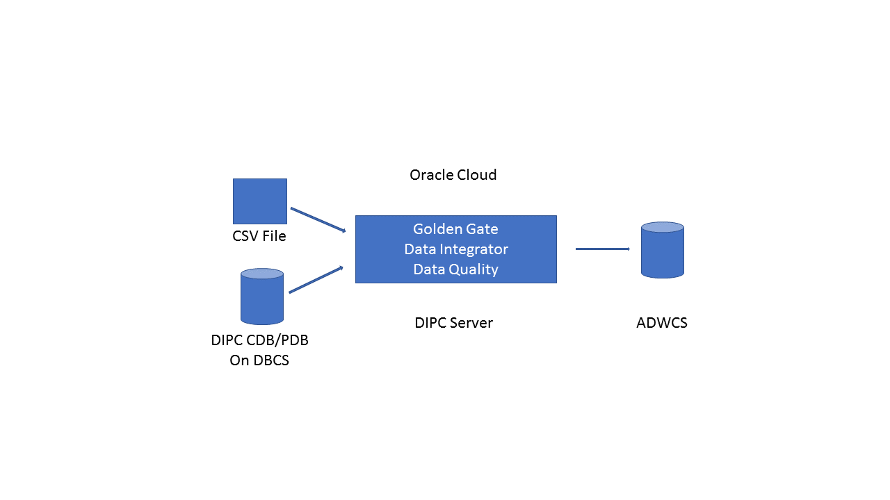

Oracle Data Integration Platform Cloud is a cloud-based platform for data transformation, integration, replication, analysis, and governance.

Data Integration Platform Cloud provides seamless batch and real-time data movement among cloud and on-premises data sources, maintaining data consistency with fault tolerance and resiliency. With Oracle Data Integration Platform Cloud, you can:

* Connect to data sources and prepare, transform, replicate, analyze, govern, and monitor data.
* Analyze data streams to gain actionable business insight
* Set up policies based on metrics to receive notifications.
* Manage all your data sources from a single platform.

Data Integration Platform Cloud provides a comprehensive cloud-based solution for all of your data integration and governance needs. With Data Integration Platform Cloud, you can synchronize an entire data source or copy high volumes of data in batches to a new Oracle Database Cloud deployment, and then easily access, transform, and cleanse your data from the platform. You can also stream data in real time to new data sources, perform data analysis on streaming data, and keep any number of data sources synchronized.

In addition to Oracle Database (including ADWCS), MySQL, and Exadata are among the databases that you can use with Oracle Data Integration Platform Cloud. You can perform homogenous or heterogeneous replication between the following:

* On-premises to Cloud
* Cloud to Cloud
* Cloud to On-premises
* On-premises to On-premises
      
For more information about DIPC, see the documentation <a href="https://docs.oracle.com/en/cloud/paas/data-integration-platform-cloud/using/getting-started-data-integration-platform-cloud.html#GUID-72E6BAA9-260B-4098-90A8-D42B95FC9010" target="_blank">Getting Started with Oracle Data Integration Platform Cloud</a>.

To **log issues**, click [here](https://github.com/millerhoo/journey4-adwc/issues/new) to go to the github oracle repository issue submission form.

## Objectives

-   Learn how to load data to ADWCS with ODI.

-   Learn how to replicate data to ADWCS with OGG.

-   Learn how to review data quality in ADWCS with EDQ.

## Required Artifacts

-   The following lab requires an Oracle Public Cloud account. You may use your own cloud account, a cloud account that you obtained through a trial, or a training account whose details were given to you by an Oracle instructor.

-   Completed Journey4-ADWC Labs 100, 200, and 300.

-   VNC Client

-   SQL Developer v18.1+

# Provision services and copy wallet and sample files

## Steps

### STEP 1: Provision DBCS and DIPC services.  (Requires ~1 Hour)
- Follow these [instructions](https://docs.oracle.com/en/cloud/paas/data-integration-platform-cloud/using/oci-classic.html) to provision the DIPC and DBCS services used in this lab.  You must use DIPC Governance Edition to include ODI, OGG, and EDQ in the deployment.  You must use version 12.1.0.2 and EE, HP, or EP edition in OCI-Classic DBCS for the DIPC database.  Be sure to select 'Configure Golden Gate' when provisioning the database as this database will also serve as the source database for OGG in the lab. The lab uses the default CDB name of ORCL and the default PDB name of PDB1.  All network access from your PC will be over ssh and we recommend using a SQL Developer ssh connection type to the database over the internet. You will first build a database service as a prerequisite for DIPC and then you will build a DIPC service as below.  If there are multiple users following the lab you will need to create unique names for your services.

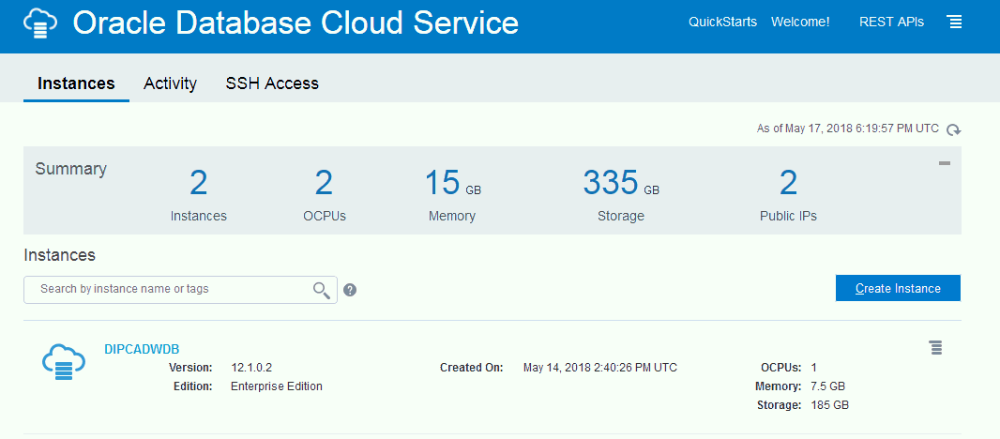

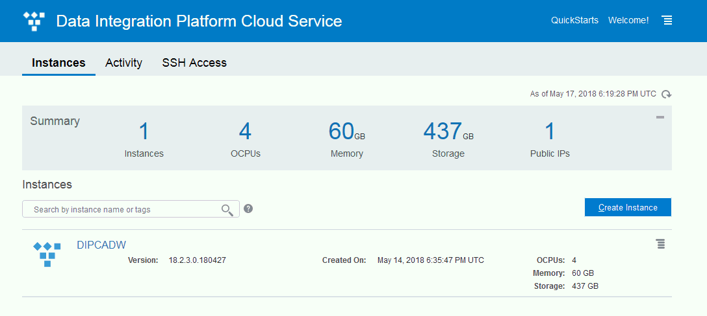


### STEP 2: Connect to your DIPC service via ssh.
- Follow these [instructions](https://docs.oracle.com/en/cloud/paas/data-integration-platform-cloud/using/accessing-virtual-machine-secure-shell.html) to connect to your DIPC service using your SSH key.  Connect using the opc user.

### STEP 3: Copy the ADWCS wallet and sample files to your DIPC server.
- Create the directory /tmp/dipcadw on your DIPC server
```
$ sudo -s
$ su - oracle
$ mkdir /tmp/dipcadw
```
- Copy the ADWC wallet zip file to /tmp/dipcadw/ using WinSCP or Filezilla.
- Run these commands to download the sample files and unzip the files.
```
$ wget https://oracle.github.io/learning-library/workshops/journey4-adwc/files/datafiles.zip -O /tmp/dipcadw/datafiles.zip
$ wget https://oracle.github.io/learning-library/workshops/journey4-adwc/files/SmartExport.xml -O /tmp/dipcadw/SmartExport.xml
$ unzip /tmp/dipadw/wallet_DIPC.zip -d /tmp/dipcadw/
$ unzip /tmp/dipcadw/datafiles.zip -d /tmp/dipcadw/
$ gunzip -- keep /tmp/dipcadw/datafiles/sales.csv.gz
```

# Configure the ADWC target for ODI, OGG, and EDQ

## Steps

### STEP 1: Configure your ADWC database instance
- Run these commands to configure ODI, OGG, and EDQ in the ADWC target using your SQL Developer Connection for the ADWC admin user from lab 200 to connect to your ADWC instance.
```
CREATE USER ODI_USER IDENTIFIED BY WelcomeDIPCADWC1;
GRANT CREATE SESSION TO ODI_USER;
GRANT DWROLE TO ODI_USER;
GRANT SELECT ANY TABLE to ODI_USER;
GRANT INSERT ANY TABLE to ODI_USER;
GRANT UPDATE ANY TABLE to ODI_USER;

ALTER USER GGADMIN IDENTIFIED BY WelcomeDIPCADWC1;

CREATE TABLE admin.channelsodi (
    channel_id                  NUMBER(6)          NOT NULL,
    channel_desc                VARCHAR2(20)    NOT NULL,
    channel_class               VARCHAR2(20)    NOT NULL,
    channel_class_id            NUMBER(6)          NOT NULL,
    channel_total               VARCHAR2(13)    NOT NULL,
    channel_total_id            NUMBER(6)          NOT NULL)
    tablespace users;

ALTER TABLE admin.channelsodi
  ADD CONSTRAINT channels_pk
  PRIMARY KEY (channel_id);

```

# Configure DIPC and DBCS

## Steps

### STEP 1: Configure the DBCS source DIPC DB
- Follow these [instructions](https://docs.oracle.com/en/cloud/paas/database-dbaas-cloud/csdbi/connect-db-using-sql-developer.html) to create a new SQL Developer connection using sys as sysdba to the DIPC PDB provisioned at the beginning of this lab.  

- If you did not select 'Enable Golden Gate' when provisioning the DBCS service you can manually enable it using dbaascli by following these [instructions](https://docs.oracle.com/en/cloud/paas/database-dbaas-cloud/csdbi/use-goldengate-service-this-service.html#GUID-3DF283C1-366D-40B0-8550-1E6003CBC751).

- If you did not select 'Enable Golden Gate' when provisioning the DBCS service, an alternate method to running the dbaascli tool is to run these commands from the SQL Developer DIPC PDB connection to configure the OGG source database.  

```
ALTER SESSION SET CONTAINER="CDB$ROOT";
select log_mode from v$database;
select supplemental_log_data_min, force_logging from v$database;
ALTER SYSTEM SET ENABLE_GOLDENGATE_REPLICATION=TRUE SCOPE=BOTH;
Alter database add supplemental log data;
Alter database force logging;
create user C##GGADMIN identified by WelcomeDIPCADWC1;
grant connect, resource to C##GGADMIN;
EXEC dbms_goldengate_auth.grant_admin_privilege('C##GGADMIN',container=>'all');
grant dba to c##ggadmin container=all;    
```

- Run these commands from the SQL Developer DIPC PDB connection to configure the OGG source database user and table that matches the channels table in ADWC you loaded in lab 300.

```
ALTER SESSION SET CONTAINER="PDB1";
CREATE USER adwc_repl IDENTIFIED BY WelcomeDIPCADWC1;
grant create session, resource, create view, create table to adwc_repl;
ALTER USER adwc_repl DEFAULT TABLESPACE "USERS" TEMPORARY TABLESPACE "TEMP";
ALTER USER adwc_repl QUOTA UNLIMITED ON USERS;
CREATE TABLE adwc_repl.channels (
    channel_id                  NUMBER(6)          NOT NULL,
    channel_desc                VARCHAR2(20)    NOT NULL,
    channel_class               VARCHAR2(20)    NOT NULL,
    channel_class_id            NUMBER(6)          NOT NULL,
    channel_total               VARCHAR2(13)    NOT NULL,
    channel_total_id            NUMBER(6)          NOT NULL)
    tablespace users;

ALTER TABLE adwc_repl.channels
  ADD CONSTRAINT channels_pk
  PRIMARY KEY (channel_id);

Insert into adwc_repl.CHANNELS (CHANNEL_ID,CHANNEL_DESC,CHANNEL_CLASS,CHANNEL_CLASS_ID,CHANNEL_TOTAL,CHANNEL_TOTAL_ID) values (3,'Direct Sales','Direct',12,'Channel total',1);
Insert into adwc_repl.CHANNELS (CHANNEL_ID,CHANNEL_DESC,CHANNEL_CLASS,CHANNEL_CLASS_ID,CHANNEL_TOTAL,CHANNEL_TOTAL_ID) values (9,'Tele Sales','Direct',12,'Channel total',1);
Insert into adwc_repl.CHANNELS (CHANNEL_ID,CHANNEL_DESC,CHANNEL_CLASS,CHANNEL_CLASS_ID,CHANNEL_TOTAL,CHANNEL_TOTAL_ID) values (5,'Catalog','Indirect',13,'Channel total',1);
Insert into adwc_repl.CHANNELS (CHANNEL_ID,CHANNEL_DESC,CHANNEL_CLASS,CHANNEL_CLASS_ID,CHANNEL_TOTAL,CHANNEL_TOTAL_ID) values (4,'Internet','Indirect',13,'Channel total',1);
 Insert into adwc_repl.CHANNELS (CHANNEL_ID,CHANNEL_DESC,CHANNEL_CLASS,CHANNEL_CLASS_ID,CHANNEL_TOTAL,CHANNEL_TOTAL_ID) values (2,'Partners','Others',14,'Channel total',1);
 commit;

```

### STEP 2: Configure DIPC TNSNAMES.ORA and SQLNET.ORA
-  To create the TNSNAMES.ora entries and SQLNET.ora files, connect to your DIPC server via ssh as user opc and run these commands.
```
$ sudo -s
$ su - oracle
$ cd /u01/app/oracle/suite/oci/network/admin
```
- Edit the tnsnames.ora file and add entries for your CDB, PDB, and ADWC.  Copy the value for low, medium, and high services from /tmp/dipcadw/tnsnames.ora into /u01/app/oracle/suite/oci/network/admin/tnsnames.ora.  

- Create an entry for your CDB by copying the existing DIPC entry 'target' and modify the name and service_name to the CDB.  It should look similar to this but have your specific information.

- Save the tnsnames.ora file.
```
target =
      (DESCRIPTION =
          (ADDRESS_LIST =
              (ADDRESS = (PROTOCOL = TCP)(HOST = DIPCADWDB)(PORT = 1521))
      )
      (CONNECT_DATA =
      (SERVICE_NAME = PDB1.590590425.oraclecloud.internal)
    )
 )

PDB1 =
      (DESCRIPTION =
          (ADDRESS_LIST =
              (ADDRESS = (PROTOCOL = TCP)(HOST = DIPCADWDB)(PORT = 1521))
      )
      (CONNECT_DATA =
      (SERVICE_NAME = PDB1.590590425.oraclecloud.internal)
    )
 )

CDB =
      (DESCRIPTION =
          (ADDRESS_LIST =
              (ADDRESS = (PROTOCOL = TCP)(HOST = DIPCADWDB)(PORT = 1521))
      )
      (CONNECT_DATA =
      (SERVICE_NAME = ORCL.590590425.oraclecloud.internal)
    )
 )

dipc_high = (description= (address=(protocol=tcps)(port=1522)(host=adwc.uscom-east-1.oraclecloud.com))(connect_data=(service_name=xxxxxxx_dipc_high.adwc.oraclecloud.com))(security=(ssl_server_cert_dn=
        "CN=adwc.uscom-east-1.oraclecloud.com,OU=Oracle BMCS US,O=Oracle Corporation,L=Redwood City,ST=California,C=US"))   )

dipc_low = (description= (address=(protocol=tcps)(port=1522)(host=adwc.uscom-east-1.oraclecloud.com))(connect_data=(service_name=xxxxxxxx_dipc_low.adwc.oraclecloud.com))(security=(ssl_server_cert_dn=
        "CN=adwc.uscom-east-1.oraclecloud.com,OU=Oracle BMCS US,O=Oracle Corporation,L=Redwood City,ST=California,C=US"))   )

dipc_medium = (description= (address=(protocol=tcps)(port=1522)(host=adwc.uscom-east-1.oraclecloud.com))(connect_data=(service_name=xxxxxxx_dipc_medium.adwc.oraclecloud.com))(security=(ssl_server_cert_dn=
        "CN=adwc.uscom-east-1.oraclecloud.com,OU=Oracle BMCS US,O=Oracle Corporation,L=Redwood City,ST=California,C=US"))   )
        
```

- Create a sqlnet.ora file in /u01/app/oracle/suite/oci/network/admin/ and add these lines.  Save the file.

```
WALLET_LOCATION = (SOURCE = (METHOD = file) (METHOD_DATA = (DIRECTORY="/tmp/dipcadw")))
SSL_SERVER_DN_MATCH=yes
```

- Test your sqlnet connections to the CDB and ADWC.

```
$ export TNS_ADMIN=/u01/app/oracle/suite/oci/network/admin/
$ export LD_LIBRARY_PATH=/u01/app/oracle/suite/oci
$ export ORACLE_HOME=/u01/app/oracle/suite/oci
$ cd $ORACLE_HOME
$ ./sqlplus sys@CDB as sysdba
$ ./sqlplus admin@dipc_low
```

### STEP 3: Configure ODI and EDQ JAVA parameters for ADWCS
-  To create the required JAVA paramters for ODI you need to add parameters as below.

```
$ vi /u01/jdk/jre/lib/security/java.security
```

- Line 1-9 should already exist.  Add lines 10 and 11 and save the file.

```
security.provider.1=sun.security.provider.Sun
security.provider.2=sun.security.rsa.SunRsaSign
security.provider.3=sun.security.ec.SunEC
security.provider.4=com.sun.net.ssl.internal.ssl.Provider
security.provider.5=com.sun.crypto.provider.SunJCE
security.provider.6=sun.security.jgss.SunProvider
security.provider.7=com.sun.security.sasl.Provider
security.provider.8=org.jcp.xml.dsig.internal.dom.XMLDSigRI
security.provider.9=sun.security.smartcardio.SunPCSC
security.provider.10=sun.security.mscapi.SunMSCAPI
security.provider.11=oracle.security.pki.OraclePKIProvider
```

- To create the required JAVA paramters for EDQ you need to add parameters as below.  Your DIPC server name will be in the path.

```
$ cd /u01/data/domains/DIPCADW_domain/config/fmwconfig/edq/oedq.local.home
$ vi jvm.properties
```

- Enter the following into that file and save the file.

```
oracle.net.tns_admin=/u01/app/oracle/suite/oci/network/admin
oracle.net.ssl_server_dn_match=true
oracle.net.ssl_version=1.2
oracle.net.wallet_location=(SOURCE=(METHOD=file)(METHOD_DATA=(DIRECTORY=/tmp/dipcadw)))
```

### STEP 4:  Restart the DIPC Service

-  Use the cloud console to stop and start the DIPC service for the JAVA settings to take effect.

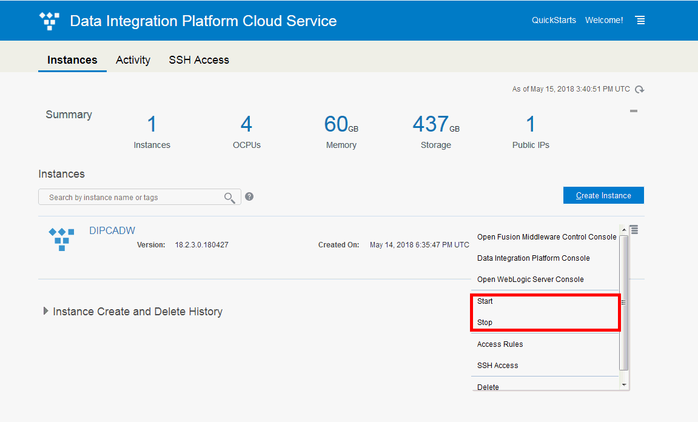

- Check the DIPC agent to ensure it is running.  Open the DIPC Console and check the status of the agent.


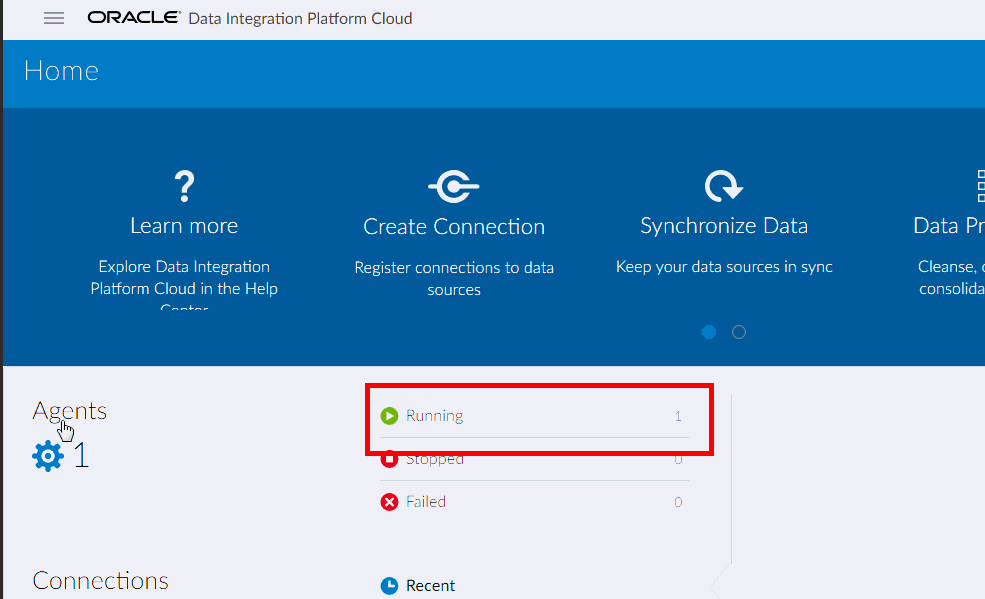

- If the agent is not running you can try to start it manually.

```
$ sudo su - oracle
$ cd /u01/data/domains/jlsData/dipcagent001/bin
$ ./startAgentInstance.sh &
```

# Use OGG with ADWCS

Oracle GoldenGate enables the exchange and manipulation of data at the transaction level among multiple, heterogeneous platforms across the enterprise. It moves committed transactions with transaction integrity and minimal overhead on your existing infrastructure. Its modular architecture gives you the flexibility to extract and replicate selected data records, transactional changes, and changes to DDL (data definition language) across a variety of topologies.

## Steps

### STEP 1:  Configure OGG 

- Connect as opc to your DIPC server via ssh and run the following commands to start ggsci.
```
$ sudo -s
$ su - oracle
$ export ORACLE_HOME=/u01/app/oracle/suite/gghome
$ cd $ORACLE_HOME
$ export LD_LIBRARY_PATH=/u01/app/oracle/suite/oci
$ export TNS_ADMIN=/u01/app/oracle/suite/oci/network/admin/
$ source ~/.ggsetup
$ ./ggsci
Oracle GoldenGate Command Interpreter for Oracle
Version 12.3.0.1.2 OGGCORE_12.3.0.1.0_PLATFORMS_171208.0005_FBO
Linux, x64, 64bit (optimized), Oracle 12c on Dec  9 2017 00:51:03
Operating system character set identified as UTF-8.

Copyright (C) 1995, 2017, Oracle and/or its affiliates. All rights reserved.

GGSCI (dipcadw-wls-1) 1>
```
- Use ggsci to modify mgr parameters
```
edit param mgr
```
- add these lines, the value for dipc_ip_address is the public ip for your dipc server
```
Dynamicportlist 7704-7760
ACCESSRULE, PROG COLLECTOR, IPADDR dipc_ip_address, ALLOW
PURGEOLDEXTRACTS ./dirdat/*, USECHECKPOINTS, MINKEEPHOURS 2
```
- next, use ggsci to modify the globals parameters
```
edit param ./GLOBALS
```
- add this line
```
ALLOWOUTPUTDIR /u01/app/oracle/suite/gghome/dirdat/
```
- restart mgr
``` 
stop mgr
start mgr
info all

Program     Status      Group       Lag at Chkpt  Time Since Chkpt

MANAGER     RUNNING
JAGENT      STOPPED
PMSRVR      RUNNING

```
- Use ggsci to create users for the source and target
```
create wallet
add credentialstore
alter credentialstore add user C##GGADMIN@CDB password WelcomeDIPCADWC1 alias ggadmin_src
alter credentialstore add user ggadmin@dipc_low password WelcomeDIPCADWC1 alias ggadmin_tgt
```
- test the connections
```
dblogin useridalias ggadmin_src
dblogin useridalias ggadmin_tgt
exit
```
- Create extract parameters
```
$ ./ggsci
edit param dipcext
```
- add the following lines that extracts data from the table adwc_repl.channels in PDB1 and save the file
```
extract dipcext
setenv (ORACLE_SID=ORCL)
useridalias ggadmin_src
exttrail ./dirdat/ad
reportcount every 2 minutes, rate
table pdb1.adwc_repl.channels;
```
- Create the extract
```
dblogin useridalias ggadmin_src
add schematrandata pdb1.adwc_repl allcols
add extract dipcext tranlog, integrated tranlog, begin now
ADD EXTTRAIL ./dirdat/ad, EXTRACT DIPCEXT
register extract dipcext, database container(PDB1)

start dipcext
info all
```
- Create replicat parameters
```
edit param adwcrep
```
- add the following lines that replicate to the ADWC table admin.channels and save the file
```
replicat adwcrep
useridalias ggadmin_tgt
map pdb1.adwc_repl.channels, target admin.channels, colmap(usedefaults), keycols(channel_id);
batchsql
```
- Create the replicat
```
add replicat adwcrep, exttrail ./dirdat/ad, nodbcheckpoint
start adwcrep

info all

Program     Status      Group       Lag at Chkpt  Time Since Chkpt

MANAGER     RUNNING
JAGENT      STOPPED
PMSRVR      RUNNING
EXTRACT     RUNNING     DIPCEXT     00:00:06      00:00:01
REPLICAT    RUNNING     ADWCREP     00:00:00      00:00:06

```
- Test the replication by inserting a row on the source dipc pdb
```
INSERT INTO "ADWC_REPL"."CHANNELS" (CHANNEL_ID, CHANNEL_DESC, CHANNEL_CLASS, CHANNEL_CLASS_ID, CHANNEL_TOTAL, CHANNEL_TOTAL_ID) VALUES ('11', 'test', 'Others', '11', 'Channel total', '1');
commit;
```
- Check the target ADWC table for the new data
```
select * from admin.channels;
CHANNEL_ID CHANNEL_DESC         CHANNEL_CLASS        CHANNEL_CLASS_ID CHANNEL_TOTAL CHANNEL_TOTAL_ID
---------- -------------------- -------------------- ---------------- ------------- ----------------
         3 Direct Sales         Direct                             12 Channel total                1
         9 Tele Sales           Direct                             12 Channel total                1
         5 Catalog              Indirect                           13 Channel total                1
         4 Internet             Indirect                           13 Channel total                1
         2 Partners             Others                             14 Channel total                1
        11 test                 Others                             11 Channel total                1

6 rows selected. 
```
- You are now replicating the channels table to ADWC and can modify the extract and replicat parameters to include other schemas and tables.

# Use ODI with ADWCS

Oracle Data Integrator provides a fully unified solution for building, deploying, and managing complex data warehouses or as part of data-centric architectures in a SOA or business intelligence environment. In addition, it combines all the elements of data integration—data movement, data synchronization, data quality, data management, and data services—to ensure that information is timely, accurate, and consistent across complex systems.

## Steps

### STEP 1: Configure and connect the VNC service on your DIPC server.  
- You will use ODI Studio through a VNC connection and ssh tunnel with putty.  Follow these [instructions](https://docs.oracle.com/en/cloud/paas/data-integration-platform-cloud/using/connecting-odi-studio-vnc-server.html#GUID-7210212B-C58C-48AC-B581-DBFD7F58B552) to create a ssh tunnel and connect to your DIPC server using VNC.  VNCServer is installed on the DIPC server and must be started first.  Be sure to use the oracle user when starting the VNCServer service and disable screen lock and screen saver after connecting the first time or you will be locked out and need to restart VNC on the server.  Be sure that you made the changes to /u01/jdk/jre/lib/security/java.security earlier in this lab to allow ODI to work with ADWC.

- To start ODI run this command in a terminal window.  Click 'No' for importing preferences.
```
/u01/app/oracle/suite/odi_studio/odi/studio/odi.sh
```
- Click on 'Open Repository Connection' and modify the connection information.
```
For ODI Connection enter your cloud user id and password.
For Database Password enter the admin password used when you provisioned DIPC.  The connection information should already be populated but if you need to find the repository username you can use your dipc pdb sqldev connection to find the username (SPXXXX_ODI_REPO).  The password is the same password you entered when you provisioned DIPC.
Select the work repository WORKREP.
Connect to the repository.
```
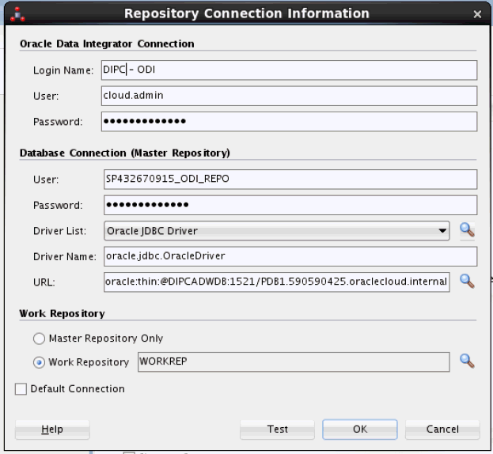

### STEP 2: Create a New Data Server for ADWC
- Navigate to the Topology tab in ODI, find the Oracle technology, right click, create a 'New Data Server'
```
Name: ADWC_DIPC_MED
Connection
Name: ODI_USER
Password: WelcomeDIPCADWC1
```
- Click on the JDBC tab of the Data Server to copy and paste the medium connection string from the tnsnames file to the jdbc url and remove any carriage returns and add the following properties by clicking on the green plus sign 3 times
```
oracle.net.ssl_server_dn_match = True
oracle.net.ssl_version = 1.2
oracle.net.wallet_location = (SOURCE = (METHOD = file) (METHOD_DATA = (DIRECTORY="/tmp/dipcadw")))
```
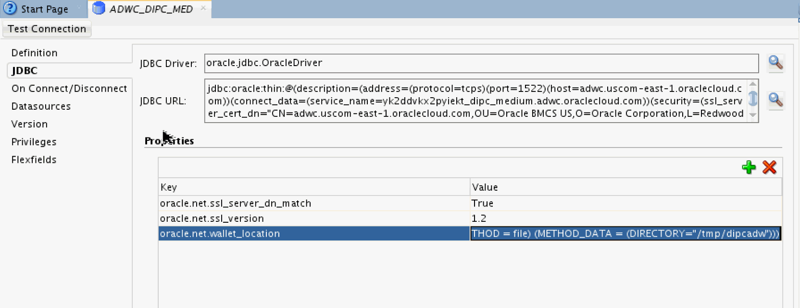
- Click 'Test Connection' and test both the local and OracleDIAgent agents for success and Ok.

### STEP 3: Create a New Physical Schema for ADWC
- Right click on the ADWC_DIPC_MED data server and add a new physical schema
```
Schema: ADMIN
Work Schema: ODI_USER
```
- Click on the Context tab of the physical schema and add a Global Context
```
Logical Schema: ADWC_ODI
```
- Click the save icon to save the physical schema
### STEP 4: Add a new model for ADWC
- Click on the 'Designer' tab and expand the 'Models' ribbon then click on the folder to select 'New Model'
- Enter the following details
```
Name: ADWC_ODI
Technology: Oracle
Logical Schema: ADWC_ODI
```
- Click Reverse Engineer to import the tables in the schema and you will now see the ADWC tables in the Models ribbon.

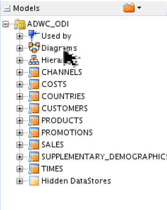


### STEP 5: Import the sample project and run mappings
- A sample project has been provided with file and table mappings to ADWC or you can build your own.  Open the Designer tab and import the sample project from /tmp/dipcadw/SmartExport.xml

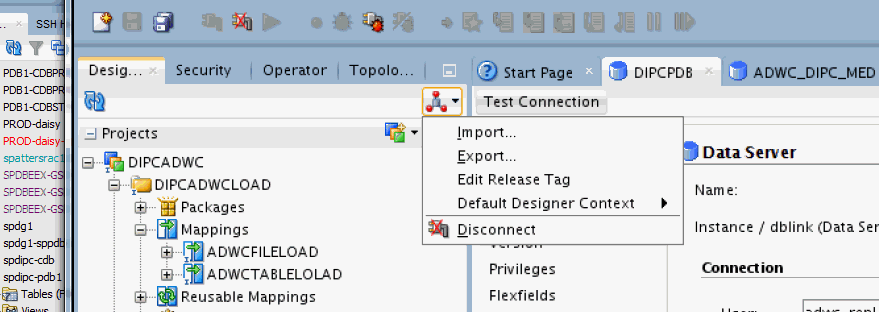

- You will need to update the password and connection information for both databases after importing the project in the Topology tab.  Edit the connections similar to step 2 of this section and test the connections.

- Review the mappings and you run the mapping individually or the load plan RunMappings. The table mapping uses the SQL to SQL Loading Knowledge Model, you can also create a db link to ADWC and use a DB Link (Push) KDM.

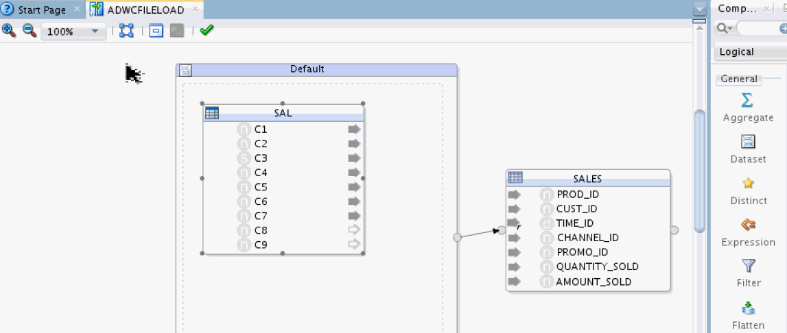

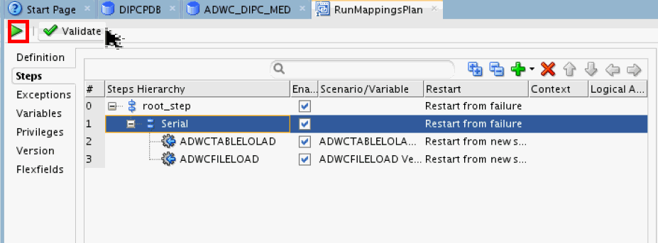

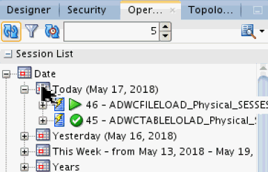

- DIPC provides the DIPC Console to run ODI jobs with ODI Console.  Open the DIPC Console.


- Click on the user image and open the ODI Console.

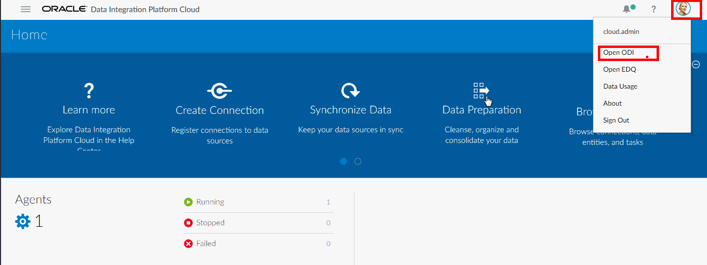

- You can review the Design Time or Topology information and run the Load Plan imported earlier.

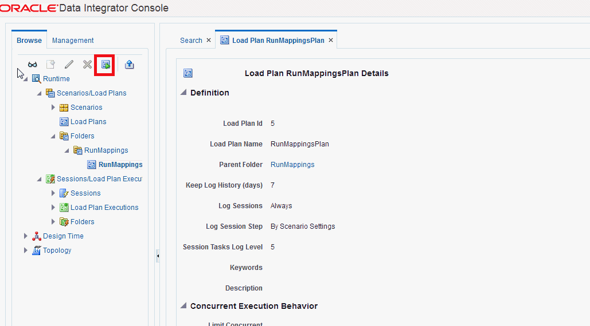

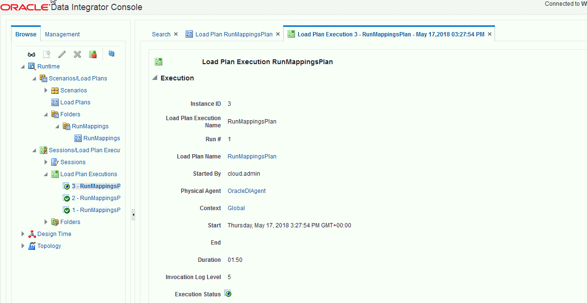


### Bonus STEP : Use DBMS_CLOUD in ODI
- A soon to be released version of DIPC ODI will provide direct integration with cloud object storage technologies.  If you want to build ETL processes using the dbms_cloud features you can embed the pl/sql blocks from lab 300 into an ODI procedure as below.  This procedure can then be used in ODI workflows.

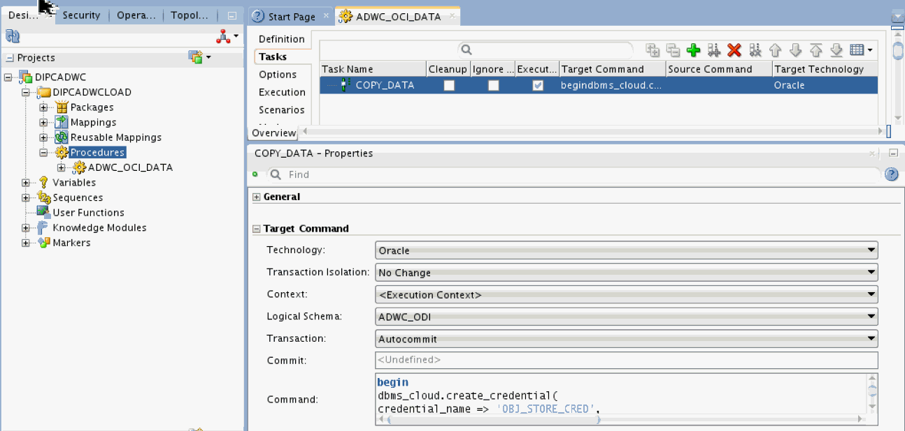


# Use EDQ with ADWCS

Oracle EDQ provides a comprehensive data quality management environment that is used to understand, improve, protect and govern data quality. EDQ facilitates best practice master data management, data integration, business intelligence, and data migration initiatives. EDQ provides integrated data quality in customer relationship management and other applications.

## Steps

### STEP 1: Connect to EDQ
- Open the DIPC Console by clicking on the user image

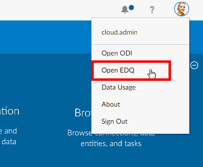

- Click on the Director Icon.  This will download a java web start file with an .jnlp extension.  Select to open the file or click on the file in the browser download to start the application.  Accept the security and run the application.


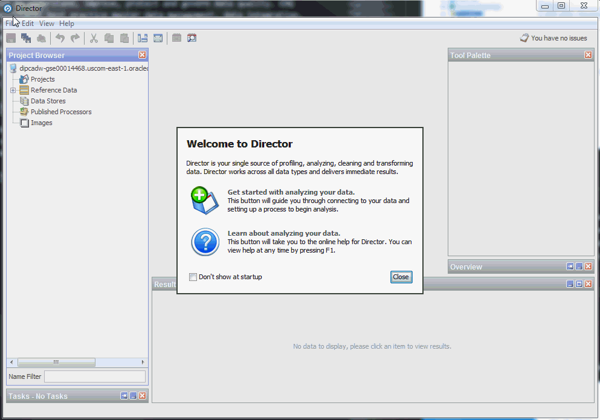

- Right click on projects to create a new project

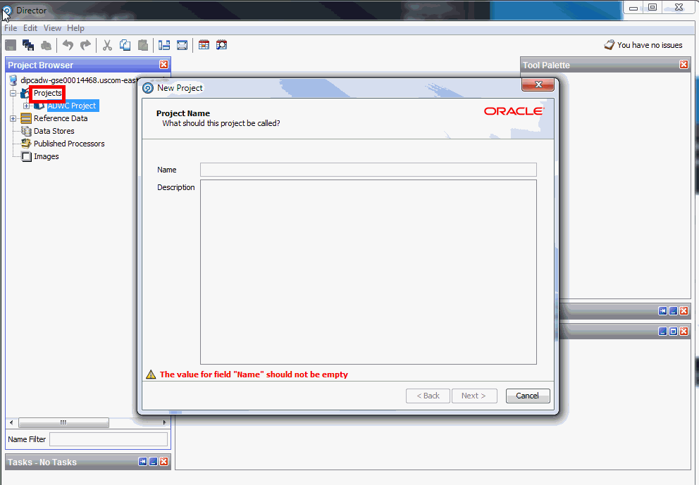

### STEP 2: Create a data store for ADWC
- Create a Data Store for ADWC by right clicking on Data Store

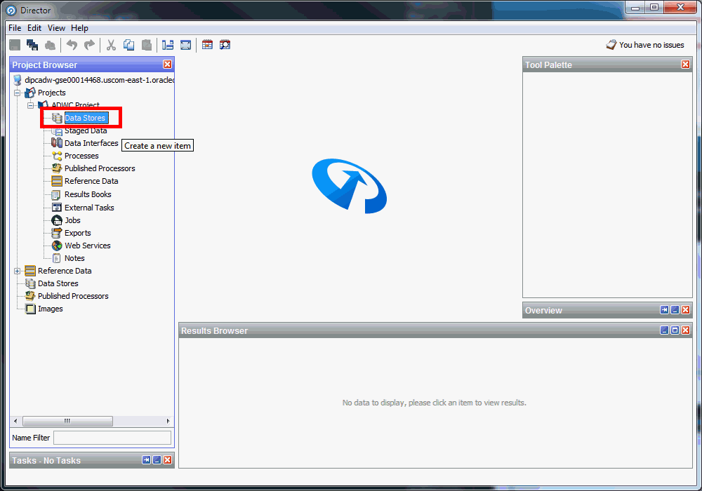

- Make the following entries in the wizard

```
Type: Oracle using TNSNAMES
TNSNAME: your ADWC connection name
User Name: ODI_USER
Password: WelcomeDIPCADWC1
Schema: admin or SSB or any schema
```

### STEP 3:  Create a snapshot of data

- Right Click Staged Data and select your datastore and tables.  You may want to limit the rows.

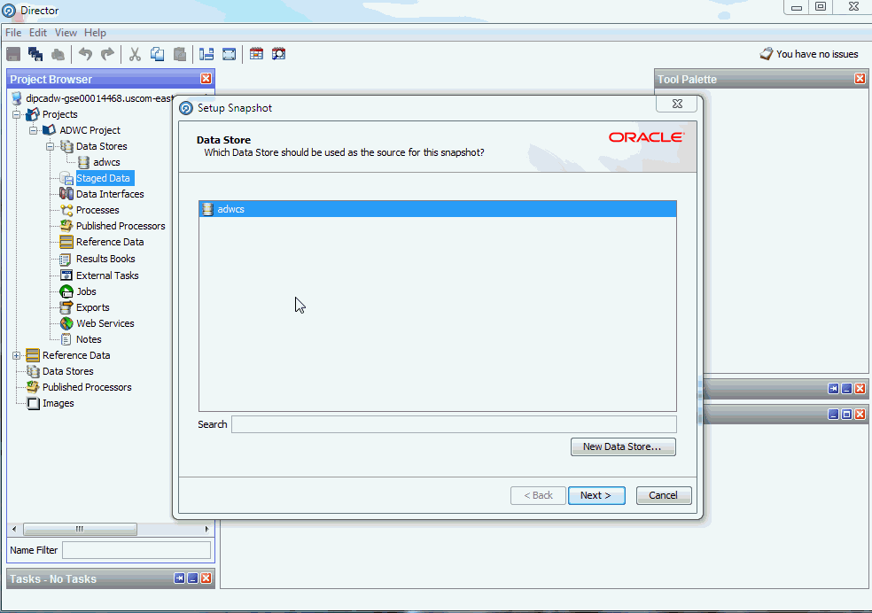

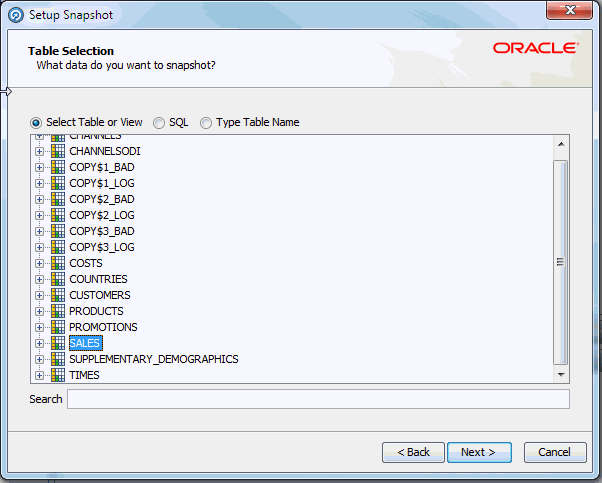

- A task will run to load the snapshot of data.

### STEP 4:  Create a Profile Process

- Right Click on Processes and select New Process.  Select the data source from the previous step.

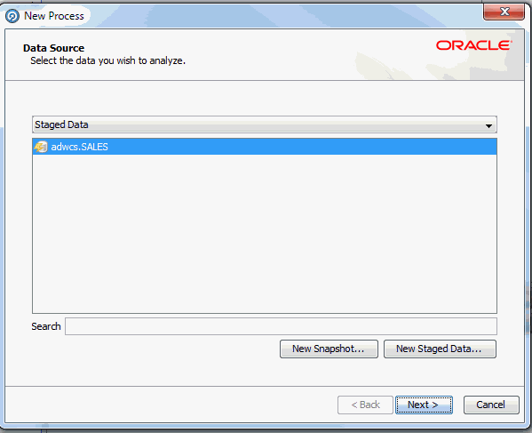

- Click next and select Add Profiling check box and uncheck Data Types and Patterns Profiles as they are invalid for this data.  Click Finish

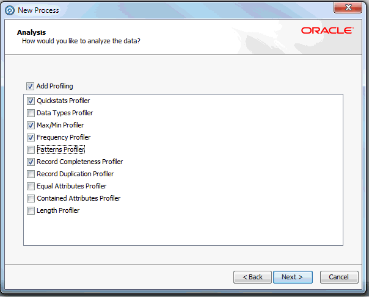

- Run the process by clicking on the green run arrow.

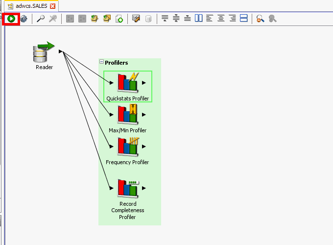

- Review the output of the profilers.

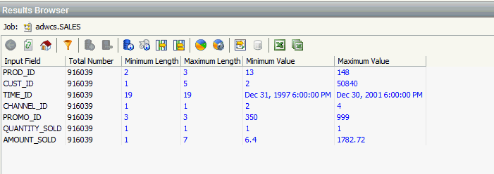

- You can now use profiling and other EDQ features with ADWCS.  Try using tables in the SSB schema on ADWCS.


